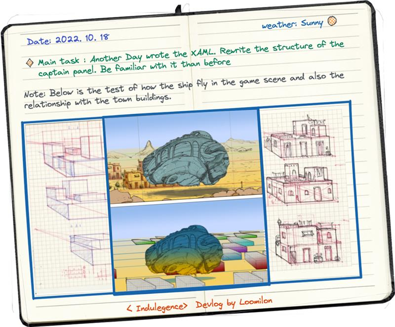
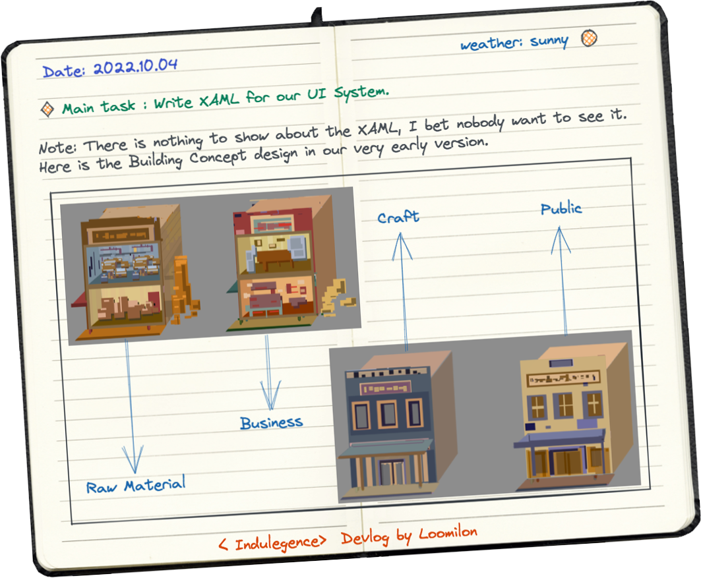
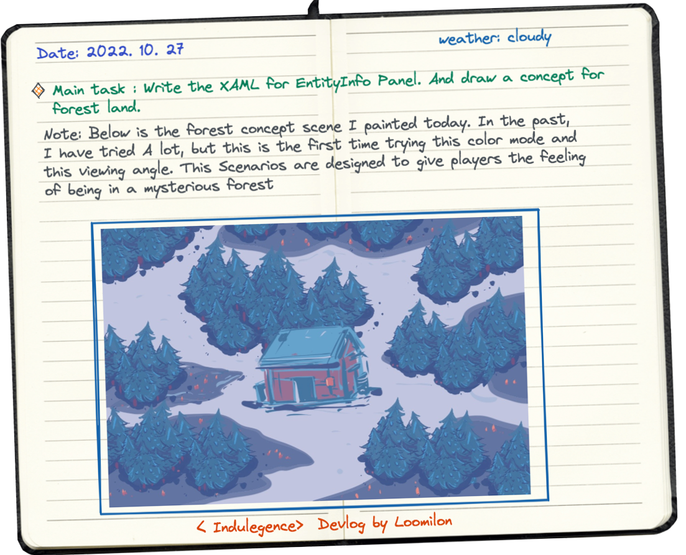

**Imagery Exploration & Core Dilemma**
In game art design, conceptualizing scene architecture is always challenging yet full of creativity. I focus first on the building’s overall imagery — how its appearance expresses its unique character and function. But one question has haunted me the whole time:
Does the exterior shell need to strictly match the interior in perspective?
<!-- more -->
The biggest obstacle is the camera zoom: as it pulls in, the outer shell “disappears,” revealing the interior. In 2D, this is even more dramatic — the shell fades, and the room jumps forward. This means the exterior’s detail level must roughly match the refinement of large furniture when viewed up close.  
That logic drove me crazy for a while, constantly doubting whether my detail was right.

**From Experiments to Perspective Breakthrough**

I did countless exterior tests and realized single-point perspective didn’t work — buildings appear in different parts of the frame but all need the same perspective direction, with interior and exterior layering consistently.

After many tries, I adopted scattered perspective and dynamic viewing from Chinese painting.  
It solved the problem beautifully: no matter where a building sits on screen, everything feels unified and natural.

**From Side-View to Orthographic: The Hard Shift to Real Depth**

Early on we used side-view: houses “open” to show 2D interiors like *Oxygen Not Included*. But walls and foreground objects overlapped badly — the image felt cramped with almost no sense of space.

I looked at *Starbound*’s pixel scenes (gorgeous, but not my strength). Eventually I returned to what I’m good at: orthographic perspective — rooms with floors and matching exterior perspective, finally achieving real interior-exterior consistency.

**Trade-offs in God’s-eye View**

Players act as “God” and need global overview, so pure linear side-scrolling felt too restrictive.  
We extended the ground plane, placing linear scenes on a larger flat surface.

Still, we refused the standard solution (*Stardew Valley*-style separation) and stuck to our perspective. This forced lots of unconventional adjustments to pathfinding, item placement, and generation mechanics — all to create a fresh visual language instead of copying others.

**Bottleneck & Compromise: Exterior–Interior Separation**

For large scenes and villages, I first tried scattered or top-down perspective for consistent space when houses open.  
It failed: every building became a boring square block with zero personality.

Stuck, I drew tons of wild shapes just to feel unstuck. Finally I decided to fully separate them: exteriors use frontal presentation for strong silhouette and recognizability, no longer tied to the interior structure.  
Not perfect, but it felt like real relief.

**Looking Back**

This whole journey took enormous effort and carried me through confusion → experimentation → persistence → acceptance.

The biggest change in me: I no longer chase the “one correct answer.”  
There is no absolute right path — only the one you choose, and the most meaningful thing is to walk it as beautifully and thoroughly as you can.